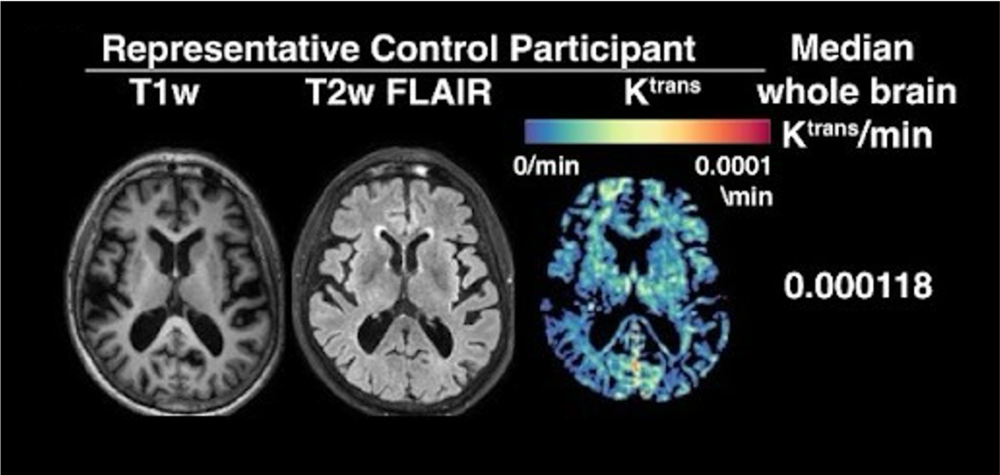

# StrokeCogBBB

https://github.com/olivia-a-jones/StrokeCogBBB/blob/main/README.md

Analysis scripts for DCE-MRI data in [Xue, Jones et al. 2026:  "Blood-brain barrier dysfunction predicts cognitive trajectory after ischemic stroke."](https://github.com/olivia-a-jones/bcsfb_modelling)

Scripts used to perform image pre-processing, tracer kinetic modelling with the Patlak model, and image segmentation/registration on simulated and in-vivo DCE-MRI data.

All quantities, processes and model definitions are [OSIPI CAPLEX compliant](https://doi.org/10.1002/mrm.29840).1 CAPLEX definitions can be accessed by clicking on quantity, process or model hyperlinks.

---
### 1. Required software
Madym2 and Madym's Python/MATLAB wrappers are required to run these scripts and can be downloaded [here](https://gitlab.com/manchester_qbi/manchester_qbi_public/madym_cxx).

For Matlab based pre- and post-processing:
SPM12 and the LST toolbox are required for registration/segmentations and can be downloaded [here](https://www.fil.ion.ucl.ac.uk/spm/software/spm12/) and [here](https://www.applied-statistics.de/lst.html).

--- 
### 2. Pre-processing of in-vivo DCE-MRI data in MATLAB: DCE_MRI_Segmentation_and_Registration_script.m
This script is designed to process our scans, and may need to be edited to be run on other DCE-MRI datasets. An example dataset can be requested by [email](olivia.jones-4@manchester.ac.uk). This script is written in **MATLAB** (required as we use SPM) and does the following:
- Averages the 2nd to 8th dynamic in the variable [prescribed flip angle](https://osipi.github.io/OSIPI_CAPLEX/quantities/#Flip%20angle) images.
- Creates a B1 map from the variable [repetition time](https://osipi.github.io/OSIPI_CAPLEX/quantities/#TR) images.
- B1-corrects the variable [prescribed flip angle](https://osipi.github.io/OSIPI_CAPLEX/quantities/#Flip%20angle) images and fits for [T1](https://osipi.github.io/OSIPI_CAPLEX/perfusionProcesses/#EstimateR10) to produce a [pre-contrast (native) T1 map](https://osipi.github.io/OSIPI_CAPLEX/perfusionProcesses/#EstimateR10).
- Realigns the dynamic [signal time-course](https://osipi.github.io/OSIPI_CAPLEX/quantities/#S) using [SPM12](https://www.fil.ion.ucl.ac.uk/spm/docs/). 

---
### 3. Fitting the Patlak model to in-vivo DCE-MRI data on HPC Cluster (bash script): Fit_Patlak_Model_SLURM.sh
This script was used to fit a Patlak model to our data on a voxel-wise basis using Madym on Manchester's **[CSF3](https://research-it.manchester.ac.uk/services/the-computational-shared-facility-csf/)** and does the following:
- Fits an a [Patlak model](https://osipi.github.io/OSIPI_CAPLEX/perfusionModels/#Patlak) of indicator uptake on a voxel-wise basis for all participants listed in an ID file 6month_IDs.txt.
  
---
### 4. Post-processing (segmentation and registration) in Matlab: DCE_MRI_Segmentation_and_Registration_script.m
This script is designed to process our scans, and may need to be edited to be run on other DCE-MRI datasets. This script is written in **MATLAB** (required as we use SPM) and does the following:
- Segments the T1w image into grey matter, white matter, and CSF using SPM's 'segment'. 
- Registers the FLAIR image to T1w space and segments the white matter hyperintensities using LST toolbox's LPA algorithm.
- Registers all parametric maps to T1w space using SPM's 'coregister'.
- Generates a 'whole brain' mask and masks parametric maps. 

---
### 5. Other post-processing and extraction of median Ktrans estimates in Python.
These brief scripts are designed to process our scans, and may need to be edited to be run on other DCE-MRI datasets. These scripts are written in **Python** and do the following:
  a) mask_wmh_stroke.py
  - Mask WMH region of interest generated previously using SPM's LST toolbox.
  - Removes any stroke voxels from the WMH mask. 
  b) make_perilesion_roi.py
  - Dilates the stroke lesion by 1cm to generate a 'peri-lesion' tissue mask.
  c) make_normal_appearing_tissue_mask.py
  - Generates a whole brain mask that excludes all lesions.
  d) Extract_medians.py
  - Computes median Ktrans and vp for various brain regions and saves output to an excel file. 

---
### References
1. Dickie BR, Ahmed Z, Arvidsson J, et al. A community-endorsed open-source lexicon for contrast agent-based perfusion MRI: A consensus guidelines report from the ISMRM Open Science Initiative for Perfusion Imaging (OSIPI). Magn Reson Med. Published online October 13, 2023. doi:10.1002/mrm.29840
2. Berks M, Parker GJM, Little R, Cheung S. Madym: A C++ toolkit for quantitative DCE-MRI analysis. Published online 2021. https://doi.org/10.5281/zenodo.5176079
